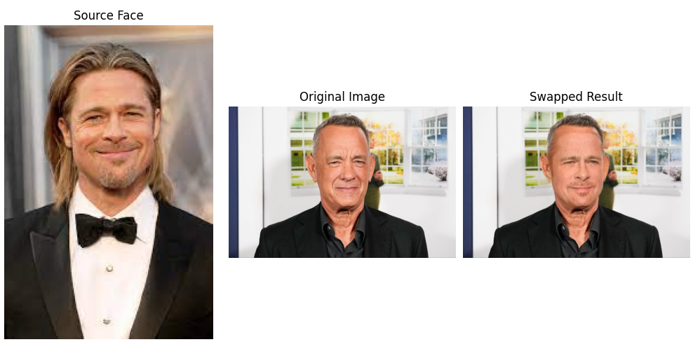

# Face Swap Project 🎭

## Description
This project implements **face swapping** using OpenCV and deep learning techniques. It allows users to swap faces in images or videos using advanced computer vision models.

## Features
✅ Real-time face detection  
✅ High-quality face swapping  
✅ Works on both images and videos  
✅ Supports deep learning-based models  

## Installation
Clone the repository:
```bash
git clone https://github.com/YaqoobD/face_swap.git
cd face_swap

## Install Dependencies
pip install -r requirements.txt

## Requirements
Python 3.8+
OpenCV
NumPy
PyTorch (for deep learning models)
Pre-trained models (e.g., sam_vit_h_4b8939.pth)

## Example Output
Here is an example of the face swap results:


